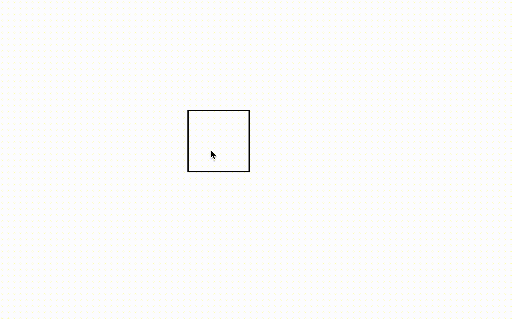

# Boxalicious

As you begin to learn JavaScript and some basic programming concepts, it is also important to investigate how they
relate to everything we have covered up until this point. JavaScript is called the "programming language
of the web" because it is used to interact with HTML and CSS, therefore making website more dynamic. This assignment
will begin to explore these connections.

## Assignment

Your task is to use HTML, CSS, and Javascript to create a box that follows your mouse movements in the browser. You are
provided with an `index.html` as a starting point. For simplicity's sake, all CSS and JavaScript will be written in
this file, even though this is generally bad practice.

Complete the following tasks with a partner:

1. Open `index.html` in the browser. You'll notice that there is a simple box in the top right corner. As of now,
   it doesn't do a whole lot, so you are going to make it a little more interesting. In the following steps,
   all of your JavaScript will go inside the empty `<script>` tags in `index.html`. 
   
2. Let's consider what needs to happen in order to complete this task. We want the box to follow the user's
   mouse, so we know that every time to mouse moves, the box's location will have to change. But how do we know when the
   mouse has moved? Luckily, JavaScript has a handy method called `addEventListener` which will listen for a specified
   event to occur, then execute some code when it does. Do some research on your own to figure out how properly use this
   method to the effect that we want (Hint: We are interested in when there is a `mousemove` within the `document`.). For now,
   code that this method executes can be left blank. Before you move onto the next step, be sure you can answer the
   following question: **What is the DOM and what is `document`?**
   
3. So, now we have an event listener attached to the DOM. This method should have two parameters. The first is
   specifying what kind of event we are listening for (in this case a `mousemove`), and the second is the function that
   will be executed when the event occurs. Next, we need to be able to access information about the event that occurred. After
   the mouse moves, we need to know the new location of the mouse. Luckily, the `addEventListener` method will pass certain
   information about the event to its second parameter. **Add a parameter called `event` to this function.** This is where
   that information will be stored. JavaScript stores all of that data as an Object, which is one of JavaScript's
   complex data types. If you want to read more about Objects, you can do so [here](https://www.w3schools.com/js/js_objects.asp),
   but it is not necessary for this assignment.
   
4. You need to be able to access the box with your JavaScript so that you can eventually change its location.
   Find a way to select the box from the HTML document and store it as a variable called `box` (Hint: `getElementById()`).
   This variable should be the first line of code inside your event listener's function.
   
5. Now you need to know how to access the mouse's location. We know that the mouse's updated position gets stored in the
   `event` Object. Before accessing it though, it's important to understand how location is represented on the screen.
   A grid turns out to be a very intuitive way of doing this because your screen is a rectangle made up of pixels,
   or cells. JavaScript will, in fact, represent the mouse's location by giving you the X and Y coordinates on the grid,
   where the location (0, 0) is the top left corner of the browser window. You can access the X and Y coordinates with
   `event.clientX` and `event.clientY` respectively. Each of these is simply a number that is 0 or greater.
   
5. Now you just need to be able to connect the mouse's location to the box. Create two more variables, `x` and `y`,
   which encode the new location that we want to move the box to. Then, use JavaScript to alter the box's CSS style and
   change is position on screen. This can and should be done with only two lines of code. As an example, if you wanted
   to set the box's `left` property to 20 pixels, you would use `box.style.left = "20px;`. Finally, open your page
   in the browser and enjoy your newly improved box!
   
6. If everything has gone well up until this point, you have a box that follows your mouse around the screen. However,
   your box is most likely positioned such that its top-left corner follows the mouse. Think about why this is. What we
   really want is for the box to be centered around the mouse. This is an easy fix though. Alter your declarations of
   `x` and `y` so that the mouse is at the center of the box (Hint: `box.clientWidth` and `box.clientHeight` will give
   you the width and height of the box, respectively.).
  
   
## Challenge (Optional)

Your box moves now, but the page is still pretty boring. You are going to make the page more colorful. First, give the
background a nice pretty gradient (Hint: Look into CSS's `linear-gradient` function.). Then, using
[CSS Animations](https://www.w3schools.com/css/css3_animations.asp), make your box change color and shape, indefinitely.

## Credit

_This demo is based off an assignment by [John-Michael Murphy](https://github.com/john-michael-murphy)._